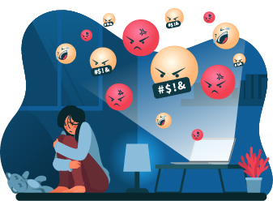

# Redes sociales - Carrusel

> "Prompt: Eres un community manager millennial que se encarga de crear contenido para un despacho de apoyo psicológico. Debes darle un formato agradable para redes sociales al siguiente texto, considera que debe ser en un lenguaje fresco y agradable pues la audiencia es también millennial, además de que el contenido sea publicado en 5 imágenes en un formato para Instagram conocido como carrusel. Así que divide el texto resultante en una tabla con dos columnas, en la primera columna pondrás el texto original y en la segunda columna pondrás el texto nuevo que debe ser fresco, moderno, millennial y agradable, lo suficientemente corto para caber en una imagen con fotografía sin perder la información principal."

*Posteriormente a este prompt agregué algo para complementar la tabla que solicité*

> "Agrega a la tabla un espacio para el llamado a la acción: el texto original es "¿Te sientes identificado en alguno de estos puntos? ¿El burn-out ya se apoderó de tu entorno de trabajo? Comunicaque con nosotros para apoyarte con psicoterapia para poder a disfrutar de tus espacios recurrentes". Mejoralo y agregalo a la tabla que hiciste anteriormente."

---

## Resultado:

| Texto Original | Versión Millennial |
|----------------|--------------------|
| Factores Personales: | ¿Qué influye en nuestro bienestar? |
| Edad y Género: Las personas más jóvenes y las mujeres pueden experimentar el burnout de manera diferente. | Sabemos que la edad y el género juegan un papel importante en cómo enfrentamos el estrés laboral. |
| Variables Familiares: La armonía y estabilidad familiar son cruciales para manejar el estrés laboral. | Una familia fuerte es clave para mantenernos a flote en el trabajo. 🏠❤️ |
| Personalidad: Las personalidades extremadamente competitivas, impacientes y perfeccionistas son más susceptibles al burnout. | Si eres de los que siempre quiere dar lo mejor, ten cuidado con el burnout. 🙌 |
| Condiciones de Trabajo: Entornos laborales deficientes, sobrecarga de trabajo y falta de apoyo son factores significativos. | Jefes, escuchad bien: un buen ambiente laboral es clave para evitar el burnout. 🌟 |
| Reconocimiento y Control: La falta de reconocimiento y la sensación de no tener control sobre el trabajo aumentan el riesgo de burnout. | ¿Te sientes invisible en la oficina? Eso podría estar afectando tu bienestar. 🙈 |
| Factores Sociales y Ambientales: | ¿Qué pasa fuera del trabajo? |
| Presión Social: La necesidad de alcanzar un estatus profesional y económico alto puede contribuir al estrés crónico. | ¡Olvídate de la presión! Tu bienestar vale más que cualquier título o salario. 💆‍♂️ |
| Eventos Vitales: Cambios significativos en la vida, como el matrimonio, divorcio o la muerte de un ser querido, también pueden desencadenar el burnout. | A veces la vida nos lanza curvas. Si estás pasando por un cambio importante, cuídate. 🌟 |
| Llamado a la Acción: | ¿Necesitas apoyo? ¡Estamos aquí para ti! |
| ¿Te sientes identificado en alguno de estos puntos? ¿El burn-out ya se apoderó de tu entorno de trabajo? Comunicaque con nosotros para apoyarte con psicoterapia para poder a disfrutar de tus espacios recurrentes. | Si necesitas ayuda, no dudes en contactarnos. Juntos encontraremos la mejor manera de recuperar tu bienestar. 🤝 |

¡Por supuesto! Aquí está la tabla actualizada con el llamado a la acción incluido: Espero que esta versión sea efectiva para conectar con tu audiencia millennial.

---

### Imagenes y resultado final:

